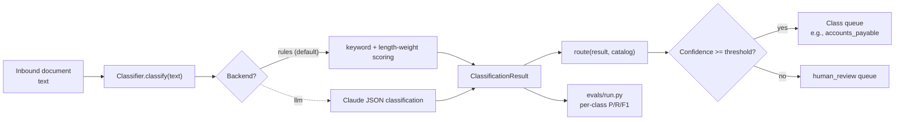

# Document classifier kit

[](https://github.com/derekgallardo01/document-classifier-kit/actions/workflows/ci.yml) [](LICENSE) [](#) [](https://codespaces.new/derekgallardo01/document-classifier-kit)

**Docs:** [Getting started](docs/getting-started.md) · [Architecture](docs/architecture.md) · [Customization](docs/customization.md) · [Evaluation](docs/evaluation.md) · [Diagrams](docs/diagrams.md) · [FAQ](docs/faq.md)

**Live demo:** [derekgallardo01.github.io/document-classifier-kit](https://derekgallardo01.github.io/document-classifier-kit/) — seven fixtures across six classes plus one ambiguous doc, with per-class confidence, top-3 candidates, and routing decisions.

Schema-driven document classifier with a pluggable backend, per-class
confidence-routed human review, and a golden eval harness reporting
per-class precision / recall / F1.

Default backend is keyword + length-weighted scoring — deterministic,
zero keys, CI-gated. The seam is one method (`Classifier._classify_llm`);
set `DOC_CLASSIFIER_BACKEND=llm` (with `ANTHROPIC_API_KEY`) to route
through Claude.

```bash
pip install -e .
doc-classifier demo                              # classify all 7 fixtures
doc-classifier list-classes                      # show the 6 classes + routes
doc-classifier classify fixtures/invoice-001.txt
```

```bash
python -m pytest -q     # 23 unit tests
python evals/run.py     # 7 golden eval cases + per-class metrics
```

Stdlib-only Python on the default path. `anthropic` is an optional extra.

## Run in Docker

```bash
docker build -t doc-classifier .
docker run --rm doc-classifier                        # runs `doc-classifier demo`
docker run --rm doc-classifier pytest -q              # runs the tests
docker run --rm doc-classifier doc-classifier classify fixtures/contract-001.txt
```

## Example: production scenario

**[examples/inbox_router.py](examples/inbox_router.py)** — Routes a directory of documents into per-queue subfolders (simulates Azure Service Bus / Postgres queue push) with a JSONL audit log of every decision

```bash
python examples/inbox_router.py
```

## What it's for

The "automate our document intake" job comes up on every SMB ops
project. The shape is always the same:

1. Documents arrive (email, shared drive, scanner, API).
2. Each one needs to land in the right queue (AP, legal, recruiting,
   customer success).
3. The classifier is **mostly right** but not always — wrong routing
   to AP for a customer complaint is a bad day. So everything below a
   confidence threshold needs to fall through to **human review**, not
   the wrong queue.
4. Six months later the LLM you used has been deprecated, the prompt's
   drifted, and you can't tell whether the misclassifications you're
   seeing are a real regression or always-have-been noise.

This kit solves (4) up front by setting the classifier up the right
way:

- **Schema-driven catalog** — each class declares its keywords + queue +
  SLA. Adding a class is one entry.
- **Confidence-routed review** — every classification carries a
  confidence score; below threshold goes to `human_review` instead
  of the wrong queue.
- **Top-k candidates with evidence** — the result includes the
  alternatives the classifier considered and which keywords matched.
  No more "I guess it picked this" debugging.
- **Golden eval harness** — gold-labelled fixtures + per-class
  precision/recall/F1 calculated on every push. CI fails if
  accuracy drops.
- **Pluggable backend** — rules-based by default (deterministic,
  free, in CI); LLM swap via one env var. Same shape out, same
  tests pass.

## Classes (the bundled catalog)

| Class | Queue | SLA | Triggers |
|---|---|---|---|
| `invoice` | `accounts_payable` | 72h | invoice, bill to, remit to, amount due, net 30 |
| `purchase_order` | `procurement` | 48h | purchase order, po #, ship to, supplier |
| `contract` | `legal_review` | 120h | agreement, parties, effective date, governing law, whereas |
| `customer_complaint` | `customer_success` | 24h | complaint, refund, cancel my, demand a refund, chargeback |
| `job_application` | `recruiting` | 120h | resume, CV, cover letter, years of experience, references |
| `spam_or_promo` | `archive_spam` | (none) | limited time offer, click here, unsubscribe, act now |

Plus an `unknown` fallback that routes everything else to human review.

Swap in your own catalog for a real engagement — one Python file. See
[docs/customization.md](docs/customization.md).

## The backend seam

```python
# src/doc_classifier/classifier.py
def classify(self, text):
    if self.backend == "llm":
        return self._classify_llm(text)
    return self._classify_rules(text)
```

Both backends return the same `ClassificationResult` shape:

```python
ClassificationResult(
    label="invoice",
    confidence=0.87,
    candidates=[("invoice", 0.87), ("purchase_order", 0.04), ...],
    evidence=["invoice", "amount due", "subtotal"],
    review_required=False,
    backend="rules",
)
```

Downstream code — the router, the CLI, the eval harness, your own
pipeline — never needs to know which backend produced the result.

`_classify_llm` ships with a documented implementation sketch for the
Anthropic SDK. Wire it when rules can't handle the long tail; the
rules backend keeps the kit CI-gated in the meantime.

## Architecture



## What `doc-classifier demo` looks like

```
  [ROUTE] complaint-001.txt              -> customer_complaint (1.00) -> customer_success
  [ROUTE] contract-001.txt               -> contract           (1.00) -> legal_review
  [ROUTE] invoice-001.txt                -> invoice            (1.00) -> accounts_payable
  [ROUTE] job-application-001.txt        -> job_application    (1.00) -> recruiting
  [ROUTE] purchase-order-001.txt         -> purchase_order     (1.00) -> procurement
  [ROUTE] spam-001.txt                   -> spam_or_promo      (1.00) -> archive_spam
  [REVIEW] ambiguous-001.txt              -> unknown            (0.00) -> human_review

  Backend: rules.  6/7 routed confidently; 1 sent to human_review.
```

The ambiguous doc is in the fixtures deliberately — it's the test that
the human-review path actually fires when nothing matches.

## What's inside

| Path | Purpose |
|---|---|
| `src/doc_classifier/schema.py` | `Catalog` + `DocClass` definitions + validation |
| `src/doc_classifier/classifier.py` | Backend dispatch + rules backend + router |
| `src/doc_classifier/cli.py` | `doc-classifier classify` / `demo` / `list-classes` |
| `fixtures/*.txt` | 7 fixtures (1 per class + 1 ambiguous) |
| `tests/` | 23 pytest tests |
| `evals/golden.json` | 7 gold-labelled cases |
| `evals/run.py` | Eval harness with per-class P/R/F1 |
| `pyproject.toml` | Package + `doc-classifier` script entry |

## Companion repos

- [pdf-extraction-kit](https://github.com/derekgallardo01/pdf-extraction-kit) — sits right after this kit in a typical pipeline: classify the doc, then if it's an invoice, extract the structured fields with that kit's invoice schema.
- [nocode-ai-lead-workflow](https://github.com/derekgallardo01/nocode-ai-lead-workflow) — same confidence-routed human-review pattern applied to leads instead of documents.
- [rag-over-docs-kit](https://github.com/derekgallardo01/rag-over-docs-kit) — once the classifier routes documents to the right queue, that kit is how an agent answers questions about their content.
