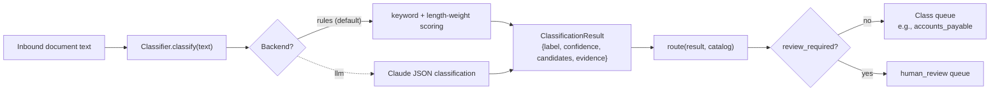
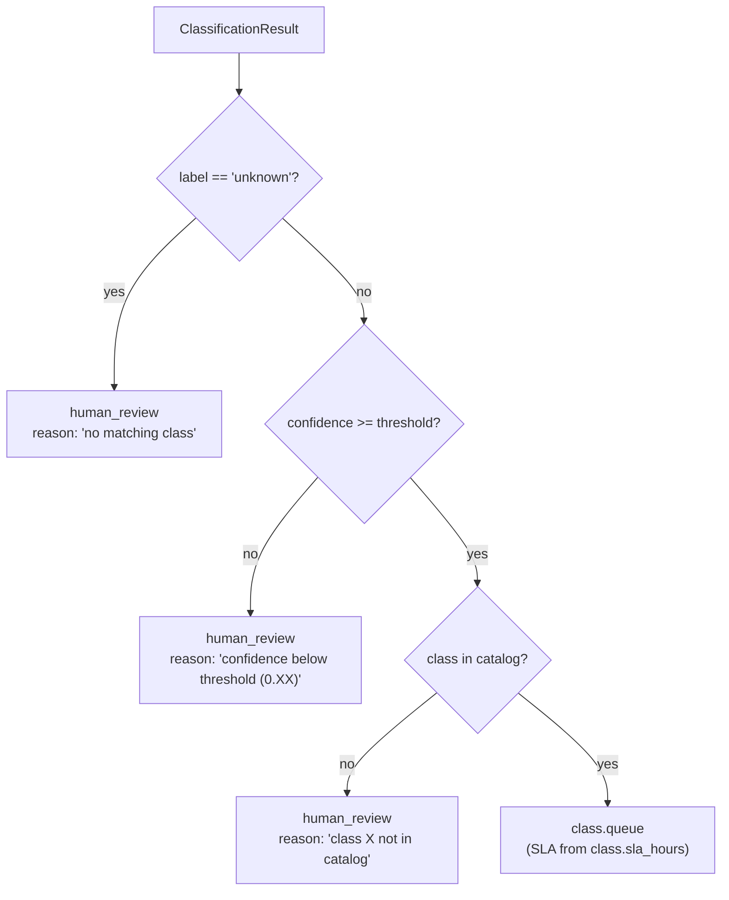
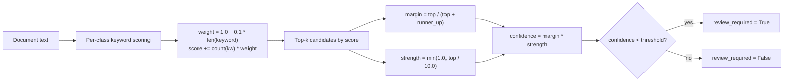
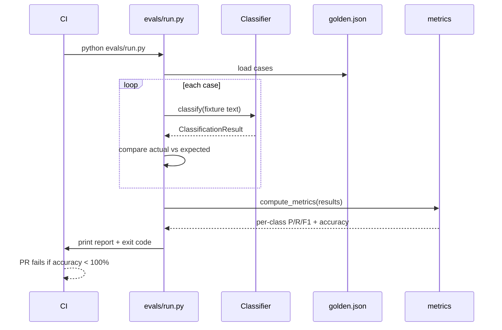
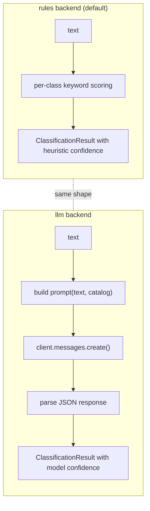
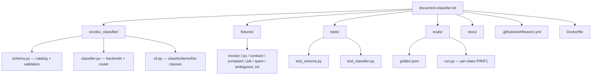

# Diagrams

GitHub renders Mermaid natively. These render on the README and in this file.

## Classify -> route pipeline

## The review-routing decision

## Confidence scoring (rules backend)

The length-weight is the trick: longer/more-specific keywords get
weighted higher per match, so "demand a refund" outweighs "refund"
when both appear.

## Eval harness

## Rules vs LLM backend

## Repo shape

